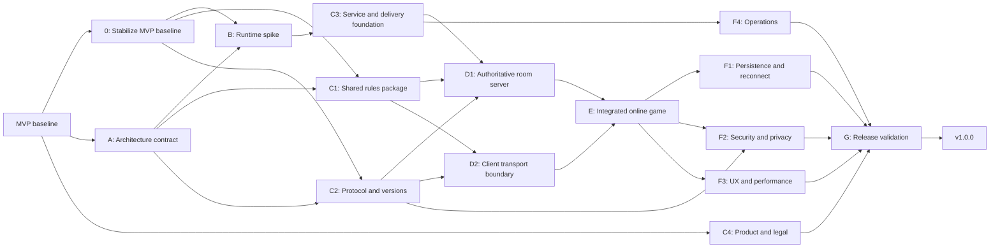

# Production v1.0.0 plan

This is the forward-looking production roadmap (previously `TODO.md`). The previous implementation roadmap has been retired: its completed work is summarized as the MVP baseline below, and its unfinished production-relevant work has been migrated into this plan.

## Scope: what this roadmap does not cover

A **UI overhaul** is planned as separate work with its own user-experience roadmap (not yet written): the non-3D (DOM/overlay) rendering becomes development-only, and all information a player needs moves into the 3D UI. That work is intentionally **not** part of this plan — this document covers the functional/architectural path to `v1.0.0` (server authority, privacy, persistence, security, operations, release).

Until the UX roadmap exists, treat UI-facing items here (MVP-01, F3-02, F3-11, F3-12) as behavior contracts, not layout decisions: costs must stay discoverable and accessibility must be preserved in whatever surface — DOM today, 3D UI after the overhaul — presents them. D2's transport boundary is deliberately UI-agnostic, so the overhaul can proceed against the same adapter without reopening this plan.

## Current status: MVP complete

The current application is the **MVP**:

- Three or four players can join a LiveKit table, claim seats, and play a complete rules-validated game through victory.
- The rules engine supports setup, production, robber/discard, building, trading, development cards, scoring, awards, and game completion.
- The React and Three.js client provides desktop/mobile gameplay, compact controls, a local development simulator, deterministic test controls, and optional table voice/video.
- Unit, rules, build, browser-flow, responsive, and render-lifecycle checks run in CI.

The MVP is not yet the production architecture. A host browser currently owns the full game and broadcasts full snapshots over LiveKit data. That means host departure stops the game, LiveKit availability is coupled to gameplay, active games are not durable, and private engine state is not protected at the network boundary.

## v1.0.0 outcome

`v1.0.0` is the first supported public production release. It uses a **server-authoritative game service** while keeping LiveKit as optional voice/video only.

Release success means:

- Three or four guests can create or join a table with a human-friendly code and finish a complete game on separate devices.
- The server owns rooms, seats, rules state, board/deck/dice randomness, command order, and persistence.
- Each client receives only its sanitized `getPlayerView`; another player's hidden resources, development cards, private points, and deck order never cross the wire.
- Refreshes and short disconnects restore the correct seat and state; host departure does not stop play.
- Active games survive service eviction, restart, and normal deployment.
- Voice/video is optional and a media failure does not prevent board play.
- The service is secure, observable, supportable, cost-controlled, tested, and documented.

## Priority and dependency notation

- **P0 — release blocker:** required for `v1.0.0`.
- **P1 — production should-have:** include unless a documented release waiver accepts the risk.
- **P2 — nice-to-have:** explicitly not required for `v1.0.0`.
- Each workstream lists `Depends on` and `Parallel with` so independent work can proceed concurrently.
- Do not begin a dependent workstream merely because its predecessor has started; its stated exit criteria must pass.

## Release sequence



### Workstream summary

| ID | Workstream | Priority | Depends on | Can run in parallel with |
|----|------------|----------|------------|--------------------------|
| 0 | Stabilize MVP baseline | P0 | Current `origin/main` | A (decision and documentation work only) |
| A | Architecture contract | P0 | Current `origin/main` | 0 |
| B | Runtime spike and selection | P0 | 0, A | Early C1, C2, C4 exploration |
| C1 | Shared rules package | P0 | 0, A | B, C2, C4 |
| C2 | Protocol, identity, and versions | P0 | 0, A | B, C1, C4 |
| C3 | Service/deployment foundation | P0 | B | C1, C2, C4 |
| C4 | Product, policy, and legal readiness | P0/P1 | Current `origin/main` | Every technical workstream; IP, trademark, copyright, asset, and naming work starts immediately |
| D1 | Authoritative room server | P0 | B, C1, C2, C3 | D2 after protocol contract stabilizes |
| D2 | Client transport and media separation | P0 | C1, C2 | D1, with explicit ownership of shared client modules |
| E | Integrated online game | P0 | D1, D2 | Focused performance and policy work |
| F1–F4 | Production hardening | P0/P1 | E or C3 as shown | Each other, with separate file ownership |
| G | Release validation and launch | P0 | All P0 F work + C4 | P1 polish that cannot destabilize RC |

## 0. Stabilize the MVP baseline

**Depends on:** current `origin/main`

**Parallel with:** A (architecture decisions and documentation do not require the green baseline; implementation workstreams B and C1–C3 require this workstream's exit)

**Exit:** the exact MVP baseline is green and its intentional compact-control behavior is covered by current tests.

- [x] **[P0][MVP-01]** Reconcile compact build controls with the player-facing cost contract: keep road/settlement/city costs discoverable and accessible even if the visible buttons use `R`, `S`, and `C` shorthand.
- [x] **[P0][MVP-02]** Update the stale building-flow Playwright assertion to test the intended compact UI without weakening resource-cost and disabled-state coverage.
- [x] **[P0][MVP-03]** Run `npm run test:ci` and restore a fully green MVP baseline before implementation workstreams (B, C1–C3) begin.
- [x] **[P1][MVP-04]** Record the MVP's known limitations and the production migration boundary in the maintained architecture documentation.

## A. Architecture contract

**Depends on:** current `origin/main`

**Parallel with:** 0 (this is decision and documentation work; it must complete before implementation spreads across client and server)

**Exit:** stable boundaries are documented before implementation spreads across client and server.

- [x] **[P0][A-01]** Adopt server-authoritative gameplay as the product architecture; the browser sends commands and renders server responses.
- [x] **[P0][A-02]** Keep Cloudflare Durable Objects as the preferred runtime candidate, with thin Node WebSocket service and Colyseus as fallbacks pending the spike.
- [x] **[P0][A-03]** Define the production topology: frontend host, game API/WebSocket origin, optional LiveKit media, DNS, TLS, and environment boundaries.
- [x] **[P0][A-04]** Define ownership of full game state, lobby state, seat credentials, RNG, player views, media identity, and persistence.
- [x] **[P0][A-05]** Define application SemVer, integer `protocolVersion`, integer `stateSchemaVersion`, and Git/build revision reporting.
- [x] **[P0][A-06]** Record the decision and diagrams in maintained architecture documentation; distinguish current MVP from target V1.
- [x] **[P0][A-07]** Define measurable release budgets: supported browsers/devices, command latency, reconnect window, concurrent rooms/players, availability target, and monthly cost alert threshold.

Suggested prerelease progression:

| Version | Meaning |
|---------|---------|
| Current `0.1.0` | MVP baseline |
| `1.0.0-alpha.1` | First end-to-end server-authoritative game |
| `1.0.0-beta.1` | Feature-complete persistence, reconnect, privacy, and optional media |
| `1.0.0-rc.1` | Production-configured release candidate |
| `1.0.0` | Supported public release |

## B. Runtime spike and platform selection

**Depends on:** 0, A

**Parallel with:** initial C1/C2 design and C4

**Exit:** one runtime is selected using evidence, not preference.

- [ ] **[P0][B-01]** Run `createGame`, `applyAction`, and `getPlayerView` inside a Cloudflare Durable Object using the prospective shared rules boundary.
- [ ] **[P0][B-02]** Connect two clients to one room and deliver a different private view to each.
- [ ] **[P0][B-03]** Accept a versioned command, reject stale and duplicate commands, and prove the action applies exactly once.
- [ ] **[P0][B-04]** Persist and restore a room after object eviction/restart, including reconnecting a seat credential.
- [ ] **[P0][B-05]** Prove the Netlify-to-game-host dual-origin path, including WebSocket connection, allowed origins, and credential transport.
- [ ] **[P0][B-06]** Run the spike locally and in CI; document Wrangler/runtime friction and test isolation.
- [ ] **[P0][B-07]** Compare Durable Objects with the thin Node fallback on implementation complexity, local testing, persistence, deployment, observability, and expected cost.
- [ ] **[P0][B-08]** Select the runtime, record the decision and tradeoffs, and record rough effort sizing for D1 and downstream workstreams before building D1.

## C1. Shared rules package

**Depends on:** 0, A

**Parallel with:** B, C2, C4

**Exit:** browser, server, and tests consume one environment-neutral rules implementation.

- [ ] **[P0][C1-01]** Move the pure rules engine into an internal workspace package such as `packages/rules`; do not make the server import browser application source.
- [ ] **[P0][C1-02]** Keep the package free of React, DOM, LiveKit, Three.js, storage, and host-specific APIs.
- [ ] **[P0][C1-03]** Preserve injected deterministic randomness for board generation, dice, robber theft, and development-deck order.
- [ ] **[P0][C1-04]** Define and test serialization/restore behavior for every authoritative state field.
- [ ] **[P0][C1-05]** Keep `getPlayerView` as the single private-state sanitizer and test every hidden-information boundary.
- [ ] **[P0][C1-06]** Move existing rules tests without reducing coverage and prove the browser build still uses the same package.

## C2. Protocol, identity, and versions

**Depends on:** 0, A

**Parallel with:** B, C1, C4

**Exit:** server and client can be implemented independently against validated contracts.

- [ ] **[P0][C2-01]** Define validated schemas for create, join, seat, ready, start, command, acknowledgement, rejection, snapshot, public event, reconnect, leave, and server-error messages.
- [ ] **[P0][C2-02]** Require `roomId`, `commandId`, `expectedVersion`, seat/session credential, and rules action on gameplay commands.
- [ ] **[P0][C2-03]** Define monotonically increasing authoritative state versions and exact duplicate/stale-command behavior.
- [ ] **[P0][C2-04]** Define an explicit seat-scoped wire view; never serialize the full engine object or unbounded action history.
- [ ] **[P0][C2-05]** Define opaque, high-entropy, server-issued seat/reconnect credentials with rotation, expiration, and revocation rules.
- [ ] **[P0][C2-06]** Add `protocolVersion` negotiation and a clear incompatible/stale-client response.
- [ ] **[P0][C2-07]** Add `stateSchemaVersion` to persisted rooms and define migration/refusal behavior.
- [ ] **[P0][C2-08]** Add contract tests shared by client and server.

## C3. Service and delivery foundation

**Depends on:** B

**Parallel with:** C1, C2, C4

**Exit:** the selected game service can be developed, previewed, deployed, and tested independently.

- [ ] **[P0][C3-01]** Create a separate game-service app/package with local, test, preview, staging, and production configuration.
- [ ] **[P0][C3-02]** Add environment validation for game origin, frontend origin allowlist, secrets, LiveKit integration, retention, and observability.
- [ ] **[P0][C3-03]** Add CI jobs for server unit tests, protocol contracts, integration tests, build/type checks, and platform-specific tests.
- [ ] **[P0][C3-04]** Configure preview/staging deployment without sharing production rooms or credentials.
- [ ] **[P0][C3-05]** Document local full-stack startup, environment setup, deployment, rollback, and secret rotation.
- [ ] **[P1][C3-06]** Automate deployment promotion from tested release candidate to production.

## C4. Product, policy, and legal readiness

**Depends on:** current `origin/main`. IP, trademark, copyright, asset-provenance, and naming research has no technical prerequisite.

**Parallel with:** 0, A, and every later engineering workstream. Start C4-01 and candidate naming immediately: they are long-lead release risks and gate any public distribution, including the invited alpha (G-08). Privacy and retention research may also start now, but the final C4-02/C4-03 policies must reflect the topology and data ownership established by A-03/A-04.

**Exit:** public distribution, naming, data use, and user support have explicit owners and decisions.

- [ ] **[P0][C4-01]** Start immediately and complete an intellectual-property review covering trademarks and naming, copyrightable rules text and audiovisual expression, trade dress, source/license provenance for every visual/audio asset, domains/store listings, and public or commercial distribution. Inventory current repository risks and document the viable paths: obtain a license, complete an original rebrand with independently created text/assets/presentation, or keep the project private and non-distributed. Plan for the likely public-release outcome being a rebrand — "Catan" is an actively enforced registered trademark — and obtain qualified legal review where material uncertainty remains. This item must be complete before the invited alpha (G-08), not merely before launch.
- [ ] **[P0][C4-02]** Publish a privacy policy covering room identifiers, seat credentials, logs, local storage, optional camera/microphone media, retention, and deletion.
- [ ] **[P0][C4-03]** Define data-retention periods for abandoned rooms, active snapshots, logs, and support artifacts.
- [ ] **[P0][C4-04]** Provide a support/contact and security-reporting path.
- [ ] **[P1][C4-05]** Publish terms of use and community expectations appropriate to the release audience.
- [ ] **[P1][C4-06]** Begin candidate naming and availability screening immediately; after C4-01 resolves the acceptable IP path, finalize production branding, domain, release notes, onboarding copy, and a basic status/incident communication channel.

## D1. Authoritative room server

**Depends on:** B, C1, C2, C3

**Parallel with:** D2 after C2 stabilizes

**Exit:** automated clients can create a room and complete a full authoritative game without LiveKit.

- [ ] **[P0][D1-01]** Create rooms with collision-resistant human-friendly codes and explicit expiration.
- [ ] **[P0][D1-02]** Implement join, seat/color claim, ready, start, presence, leave, and host/lobby-role behavior. Define non-seated joiners explicitly: v1 rejects them with a clear room-full/seats-taken response — spectator mode is deferred to P2, and the MVP lobby's spectator support does not carry into the authoritative server.
- [ ] **[P0][D1-03]** Store the only full authoritative lobby and game state on the server.
- [ ] **[P0][D1-04]** Generate the board, dice, development deck, and theft outcomes exclusively on the server.
- [ ] **[P0][D1-05]** Serialize command handling per room and apply every game mutation through server-side `applyAction`.
- [ ] **[P0][D1-06]** Authenticate the sender's seat and reject malformed, unauthorized, stale, duplicate, illegal, and out-of-turn commands.
- [ ] **[P0][D1-07]** Acknowledge every command with its command ID and authoritative version.
- [ ] **[P0][D1-08]** Send each connection only its `getPlayerView` plus explicitly public lobby/events.
- [ ] **[P0][D1-09]** Bound in-memory command deduplication and event history so long games cannot grow without limit.
- [ ] **[P0][D1-10]** Add deterministic room-level integration tests covering a full game path and all rejection classes.

## D2. Client transport and media separation

**Depends on:** C1, C2 — D2-02 and D2-04 rework the same client modules whose rules imports move to `packages/rules` in C1; sequencing D2 after C1 avoids conflicting edits to shared files.

**Parallel with:** D1, with explicit ownership of shared client modules

**Exit:** the UI does not know whether commands are handled locally or by the production server, and media is optional.

- [ ] **[P0][D2-01]** Introduce a transport interface for connect, command, acknowledgement, snapshot, reconnect, and leave.
- [ ] **[P0][D2-02]** Keep the local simulator behind a local transport adapter for development and deterministic browser tests.
- [ ] **[P0][D2-03]** Add the production HTTP/WebSocket adapter against the C2 contract.
- [ ] **[P0][D2-04]** Render only server-provided player views in online mode; never retain or infer another seat's private state.
- [ ] **[P0][D2-05]** Remove gameplay dependence on LiveKit membership and data packets.
- [ ] **[P0][D2-06]** Load and join LiveKit only after the player explicitly enables optional media.
- [ ] **[P0][D2-07]** Show incompatible-client, disconnected, reconnecting, rejected-command, and server-unavailable states without corrupting local UI state.
- [ ] **[P1][D2-08]** Remove the host-authoritative production transport after server dogfood proves replacement behavior; retain only deliberate development fallback code.

## E. Integrated online game

**Depends on:** D1, D2

**Parallel with:** contained C4 and performance work that does not touch transport/room files

**Exit:** `1.0.0-alpha.1`—three or four remote clients can finish a server-authoritative game.

- [ ] **[P0][E-01]** Add clear Create Table and Join Table flows with code validation and shareable invite links.
- [ ] **[P0][E-02]** Add seat/color selection, connected/ready state, host start controls, and actionable lobby errors.
- [ ] **[P0][E-03]** Route every setup and gameplay action through the server adapter and reconcile acknowledgements/snapshots.
- [ ] **[P0][E-04]** Preserve all existing rules workflows, compact controls, 3D interactions, and game-over behavior in online mode.
- [ ] **[P0][E-05]** Make voice/video an optional action after joining the game; denial or failure of media permission must not block play.
- [ ] **[P0][E-06]** Show presence, temporary disconnect, reconnect, explicit leave, and abandoned-seat states.
- [ ] **[P0][E-07]** Prove host departure leaves the authoritative game available to remaining players.
- [ ] **[P0][E-08]** Add multi-browser Playwright coverage for lobby, setup, normal turns, robber, trade, development cards, and victory.
- [ ] **[P1][E-09]** Add a rematch flow that retains the room and seated players.

## F1. Persistence and reconnect

**Depends on:** E

**Parallel with:** F2, F3, F4

**Exit:** active games recover correctly across client and server interruptions.

- [ ] **[P0][F1-01]** Persist an active-room snapshot after every accepted state-changing command.
- [ ] **[P0][F1-02]** Restore the room, versions, command-deduplication state, seats, and required RNG state after eviction/restart.
- [ ] **[P0][F1-03]** Reconnect a refreshed client using its server-issued credential and deliver the latest seat-scoped snapshot.
- [ ] **[P0][F1-04]** Recover from missed messages by replacing client state with an authoritative versioned snapshot.
- [ ] **[P0][F1-05]** Define reconnect grace, explicit leave, seat abandonment, room expiration, and cleanup behavior.
- [ ] **[P0][F1-06]** Test schema migration or explicit safe refusal for every persisted-state change introduced before release.
- [ ] **[P0][F1-07]** Prove an active game survives the normal production deployment procedure.
- [ ] **[P1][F1-08]** Add an operator-supported active-room export/restore tool that preserves private-state controls.

## F2. Security and privacy hardening

**Depends on:** E and C2

**Parallel with:** F1, F3, F4

**Exit:** the public boundary has a reviewed threat model and automated abuse/privacy tests.

- [ ] **[P0][F2-01]** Write a threat model for seat theft, room-code guessing, command replay, stale clients, malformed payloads, cross-origin requests, information leaks, and denial of service.
- [ ] **[P0][F2-02]** Validate every HTTP and WebSocket payload and enforce strict size limits.
- [ ] **[P0][F2-03]** Add rate limits for room creation/join, authentication failures, and commands.
- [ ] **[P0][F2-04]** Enforce the production origin allowlist and document cookie/bearer-token, CSRF, and CORS decisions.
- [ ] **[P0][F2-05]** Rotate/revoke seat credentials and prevent a replaced connection from continuing to command the seat.
- [ ] **[P0][F2-06]** Ensure logs, errors, analytics, snapshots sent to clients, and LiveKit metadata never expose hidden hands, deck order, credentials, or secrets.
- [ ] **[P0][F2-07]** Scope optional LiveKit tokens to the authenticated room/identity instead of trusting arbitrary client-provided grants.
- [ ] **[P0][F2-08]** Add automated wire-capture privacy tests for every seat and spectator-like unauthenticated client.
- [ ] **[P0][F2-09]** Add dependency/security scanning and resolve high/critical production findings.
- [ ] **[P1][F2-10]** Add CSP and other applicable browser security headers and verify them in deployment tests.

## F3. Production UX, accessibility, and performance

**Depends on:** E; contained asset work may begin after A

**Parallel with:** F1, F2, F4 when file ownership does not overlap

**Exit:** supported mobile and desktop devices meet the agreed usability and performance budgets.

- [ ] **[P0][F3-01]** Test create/join, full gameplay, reconnect, media opt-in, and errors at supported desktop/mobile breakpoints with mouse and touch.
- [ ] **[P0][F3-02]** Preserve keyboard/focus semantics, screen-reader labels, contrast, reduced-motion behavior, and non-color-only status indicators.
- [ ] **[P0][F3-03]** Compress/resize the multi-megabyte table textures and use an appropriate modern production format with fallback.
- [ ] **[P0][F3-04]** Disable test-only `preserveDrawingBuffer` in production, cap mobile pixel ratio, and reduce mobile shadow cost.
- [ ] **[P0][F3-05]** Lazy-load LiveKit/media code so board-only players do not pay its startup cost.
- [ ] **[P0][F3-06]** Measure and enforce first-usable-board, command-to-visible-update, reconnect, bundle-size, and mobile frame-rate budgets.
- [ ] **[P0][F3-07]** Verify CDN caching and Brotli/gzip for hashed assets on the selected frontend host.
- [ ] **[P1][F3-08]** Reuse stable materials and remove unnecessary scene-update settling delays.
- [ ] **[P1][F3-09]** Render on demand when idle; animate only while controls, dice, or highlights require frames.
- [ ] **[P1][F3-10]** Add a clear stale-version/update-required prompt that preserves the user's room reconnect path.
- [ ] **[P0][F3-11]** Keep build costs available in compact controls through visible text or an equally discoverable accessible pattern.
- [ ] **[P1][F3-12]** Restore compact contextual rules help and an action/event history without covering the 3D board on supported screens.
- [ ] **[P1][F3-13]** Profile the React/Three.js boundary and memoize or split control state only where measurements show avoidable scene work.

## F4. Operations, observability, and cost control

**Depends on:** C3; full validation depends on E

**Parallel with:** F1, F2, F3

**Exit:** an operator can detect, diagnose, mitigate, and communicate production failures.

- [ ] **[P0][F4-01]** Add structured logs keyed by environment, room ID, connection/session ID, command ID, state version, protocol version, result, and latency—without private game contents.
- [ ] **[P0][F4-02]** Add metrics for active rooms/connections, create/join failures, command accepts/rejects, reconnects, persistence failures, latency, errors, and runtime/storage usage.
- [ ] **[P0][F4-03]** Configure error monitoring and actionable alerts for availability, elevated failures, persistence errors, and cost anomalies.
- [ ] **[P0][F4-04]** Add health/readiness checks and a deployment smoke test that creates, joins, commands, persists, and reloads a test room.
- [ ] **[P0][F4-05]** Document incident response, rollback, secret rotation, room recovery, provider outage behavior, and user communication.
- [ ] **[P0][F4-06]** Set provider budgets/alerts and validate expected Netlify, game-runtime, storage, and optional LiveKit subscription costs under the release load target.
- [ ] **[P0][F4-07]** Define retention and deletion jobs and verify expired rooms no longer consume storage.
- [ ] **[P1][F4-08]** Add a minimal internal diagnostic view or documented queries for support without exposing hidden state.

## G. Release validation and launch

**Depends on:** all P0 items in F1–F4 and C4

**Parallel with:** low-risk P1 polish only

**Exit:** release checklist passes on the exact production candidate and `v1.0.0` is tagged from that revision.

### Automated release gates

- [ ] **[P0][G-01]** Run all rules, client, server, contract, persistence, security, build, render, and multi-client browser suites in CI.
- [ ] **[P0][G-02]** Complete full three-player and four-player games using separate browser contexts against the production server implementation.
- [ ] **[P0][G-03]** Test simultaneous commands, retries, duplicates, stale versions, unauthorized seats, malformed/oversized payloads, and room-code abuse.
- [ ] **[P0][G-04]** Test refresh, network interruption, host departure, missed snapshots, service eviction/restart, and deployment during an active game.
- [ ] **[P0][G-05]** Prove every outbound payload preserves the `getPlayerView` privacy contract.
- [ ] **[P0][G-06]** Prove LiveKit/media denial or outage does not block or desynchronize gameplay.
- [ ] **[P0][G-07]** Load-test the agreed concurrent-room/player target and stay inside latency, error-rate, storage, and cost budgets.

### Release process

- [ ] **[P0][G-08]** Run an invited alpha, record defects/operational gaps, and meet the alpha exit criteria. Requires C4-01 complete: do not distribute under unlicensed branding, even to an invited audience.
- [ ] **[P0][G-09]** Run a hosted beta/soak period with production observability and meet the beta exit criteria.
- [ ] **[P0][G-10]** Freeze `1.0.0-rc.1`; permit only reviewed release-blocker fixes and rerun every gate after changes.
- [ ] **[P0][G-11]** Verify production environment variables, domains, TLS, policies, support contacts, dashboards, alerts, provider budgets, and rollback.
- [ ] **[P0][G-12]** Perform and document a rollback/recovery drill using the release candidate.
- [ ] **[P0][G-13]** Publish release notes and known limitations, update the app/package version, expose build revision diagnostics, and tag `v1.0.0`.
- [ ] **[P0][G-14]** Monitor the launch window with explicit owners and go/no-go/rollback authority.

## v1.0.0 release checklist

All statements must be true; a P0 exception requires an explicit no-go decision, not a silent deferral.

- [ ] Full three- and four-player games work on supported separate devices.
- [ ] The server is the only gameplay authority and host departure does not end the game.
- [ ] Active games recover after client refresh, server restart/eviction, and normal deployment.
- [ ] No client or operational output receives another player's hidden information.
- [ ] Voice/video is optional and isolated from gameplay availability.
- [ ] Security, privacy, IP/naming, retention, and support requirements are complete.
- [ ] Performance, concurrency, availability, and cost budgets pass.
- [ ] Monitoring, alerts, incident response, rollback, and provider budgets are active.
- [ ] CI and release-candidate validation pass on the exact tagged revision.

## P2: explicitly deferred beyond v1.0.0

These may be researched or designed, but must not delay the critical path unless promoted through a documented scope decision:

- Public matchmaking and room discovery.
- User accounts, profiles, friends, invitations, and cross-device identity.
- Spectator mode (including carrying the MVP lobby's spectator support into the authoritative server; v1 rejects non-seated joiners — see D1-02).
- Bots or single-player AI.
- Text chat, moderation systems, and social features beyond optional table media.
- Leaderboards, ratings, achievements, seasons, and progression.
- Completed-game history, replay UI, and shareable replays.
- Native mobile applications or a separate phone-controller application.
- Local pass-and-play privacy handoff and local save/resume.
- Additional maps, expansions, house rules, or configurable rule variants.
- Cosmetic marketplace, advanced avatars, elaborate animation polish, and nonessential visual effects.
- Multi-region active/active game authority before measured demand requires it.

## Verification commands

Keep these commands green throughout development; add server and multi-client commands as their packages are introduced.

```bash
npm test
npm run test:rules
npm run build
npm run test:e2e
npm run test:ci
```
