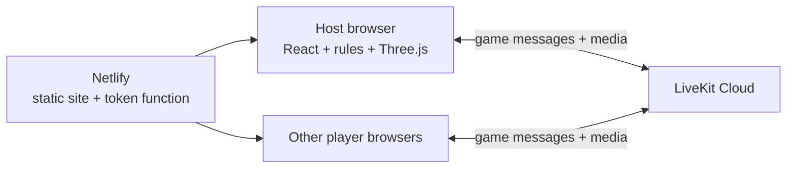
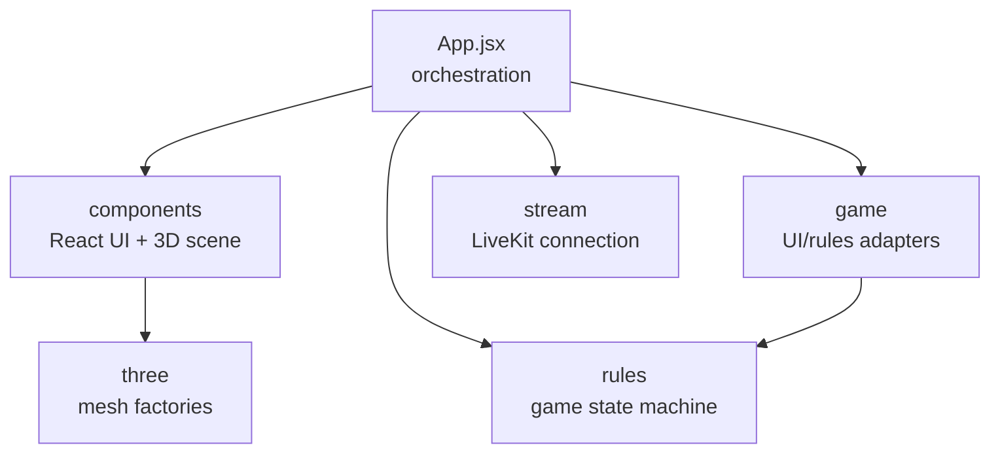

# Project architecture

This is the high-level map of the project. It explains what runs where, which tools are used, and where the major code areas live. Follow the linked subdirectory guides for one level more detail.

## What the project is

This is a browser-based, three- or four-player Catan-style board game. It includes a complete rules engine, a React interface, an interactive Three.js table, online table presence, and optional voice/video.

## Where it runs today

The current MVP is **host-authoritative**: one player's browser holds the full game state and applies the rules. There is no dedicated game server or game database yet.

- **Netlify** serves the built web application and runs the function that signs LiveKit tokens.
- **LiveKit Cloud** connects players for voice/video and currently transports lobby actions and game snapshots.
- **The host browser** is the current game authority.
- **Local test mode** runs the same rules locally without joining LiveKit and is available only in development builds.

The production plan moves game authority to a dedicated room service. Cloudflare Durable Objects are the preferred candidate pending a spike; a thin Node service or Colyseus are fallbacks. LiveKit then becomes optional media only. See the [production architecture contract](production-architecture.md) and [ROADMAP.md](../ROADMAP.md).

## Main tools

| Tool | Role |
|------|------|
| React | Application state, screens, controls, and component composition |
| Three.js | 3D board, pieces, cards, dice, highlights, and camera interaction |
| JavaScript rules engine | Validates commands and produces authoritative game state |
| LiveKit | Current room transport plus optional voice/video |
| Netlify | Static hosting and LiveKit token function |
| Vite | Local development and production bundling |
| Vitest / Node test | Rules, board, and application-module tests |
| Playwright | Full browser flows and 3D rendering checks |
| GitHub Actions | CI for tests and production builds |

## How the code is divided

| Area | Responsibility | Guide |
|------|----------------|-------|
| `src/` | Browser application composition and state flow | [Client architecture](../src/ARCHITECTURE.md) |
| `src/components/` | React controls and the Three.js scene component | [Component architecture](../src/components/ARCHITECTURE.md) |
| `src/game/` | Board generation, topology, interactions, and rules/UI translation | [Game adapter architecture](../src/game/ARCHITECTURE.md) |
| `src/rules/` | UI-independent authoritative rules and private player views | [Rules architecture](../src/rules/ARCHITECTURE.md) |
| `src/stream/` | LiveKit room, media, presence, and current data transport | [Streaming architecture](../src/stream/ARCHITECTURE.md) |
| `src/three/` | Reusable Three.js mesh construction | [Rendering architecture](../src/three/ARCHITECTURE.md) |
| `netlify/` | Hosting configuration and server-side token signing | [Netlify architecture](../netlify/ARCHITECTURE.md) |
| `tests/` | Unit, integration, browser, and render verification | [Test architecture](../tests/ARCHITECTURE.md) |

## Basic action flow

1. A control or 3D target asks `App.jsx` to perform an action.
2. `src/game` translates the UI intent into a rules command and derives legal targets/render data.
3. `src/rules` validates the command and returns the next authoritative state.
4. React controls and `CatanScene` render the new state.
5. In current multiplayer, the host sends the resulting snapshot to other browsers through LiveKit.

## Documentation rule

Keep this file short and update it only when tools, hosting, runtime boundaries, or top-level code ownership change. Put module-level interactions in the nearest `ARCHITECTURE.md`; put API details and operational instructions in README files or code.
