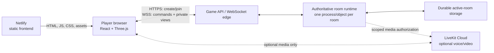

# Production architecture contract

**Status:** adopted for `v1.0.0` planning. The product boundary is fixed; the game-service runtime remains provisional until the B spike selects Durable Objects, thin Node, or Colyseus.

This document is the maintained contract between the browser, game service, persistence, and optional media. It defines ownership and release targets without prescribing internal implementation details.

## Non-negotiable V1 boundaries

- The game service is authoritative. Browsers submit commands and render server responses.
- Only the authoritative service holds complete lobby and game state, controls randomness, orders commands, and persists active rooms.
- Each connection receives a seat-scoped view produced through the rules privacy boundary; full engine state never crosses the player-facing wire.
- LiveKit is optional media. Creating, joining, reconnecting to, and finishing a game cannot depend on LiveKit.
- The browser and server consume the same environment-neutral rules package and validated protocol schemas.
- The host is a lobby role, not the rules process. Host departure does not stop the room.

## Target topology

- Netlify remains the preferred frontend host.
- The game service uses a separate HTTPS/WSS origin such as `game.<production-domain>`; the client reads it from public build configuration.
- Cloudflare Workers plus one Durable Object per room are the first spike target. Thin Node WebSocket service and Colyseus must preserve this contract if selected instead.
- Production, staging/preview, test, and local environments use separate origins, secrets, storage namespaces, room namespaces, and LiveKit credentials.
- TLS is required outside local development. The game origin accepts only explicit frontend origins; it does not use a wildcard production CORS policy.
- The media-token boundary must validate a game-server-issued room/seat grant. Client-provided room names or identities are not sufficient authorization.

## Ownership

| Concern | Authoritative owner | Browser responsibility |
|---------|---------------------|------------------------|
| Room code and lifecycle | Game service | Request create/join and display status |
| Lobby, seats, ready state, and host role | Game service | Submit intent and render public/seat state |
| Full rules state and board/deck order | Room runtime | Never store or receive the complete object in production |
| Dice, deck shuffle, robber theft, and board RNG | Room runtime | Animate the authoritative result |
| Command order, deduplication, and state version | Room runtime | Generate command IDs, send expected version, handle acknowledgement/rejection |
| Private player view | Game service via `getPlayerView` | Render only the received seat-scoped projection |
| Seat/reconnect credential | Game service issues, scopes, rotates, expires, and revokes | Hold the opaque credential and present it for reconnect; never infer authority from local identity |
| Active-room persistence | Game service storage | No authoritative browser save |
| Media identity and room authorization | Game service grant plus LiveKit token service | Opt in to media and manage local tracks |
| Camera/microphone tracks | LiveKit and participating browsers | Explicit opt-in, device controls, and track cleanup |
| UI interaction and transient animation | Browser | May be discarded and reconstructed from the current server view |

The C2 threat model decides whether the reconnect credential uses a secure cookie or explicit opaque token storage. Regardless of transport, it must be high entropy, room/seat scoped, revocable, excluded from URLs and logs, and insufficient to reveal another seat's view.

## Versions and compatibility

| Version | Purpose | Required behavior |
|---------|---------|-------------------|
| Application SemVer | Communicates product releases | Client and game service ship from one repository version; builds expose SemVer and Git revision in diagnostics |
| `protocolVersion` | Protects client/server message compatibility | Every handshake includes an integer; incompatible clients receive a clear refresh/update rejection |
| `stateSchemaVersion` | Protects persisted-room compatibility | Every snapshot includes an integer; loaders explicitly migrate a supported schema or refuse it without partial mutation |
| `stateVersion` | Orders one room's live state | Increases after each accepted command; stale expected versions are rejected |
| `commandId` | Makes retries idempotent | Duplicate IDs return the recorded result and never apply twice |

The release progression is `0.1.0` MVP, `1.0.0-alpha.1` first authoritative game, `1.0.0-beta.1` feature-complete persistence/privacy/reconnect, `1.0.0-rc.1` production candidate, then `1.0.0`.

## Initial release budgets

These are measurable V1 acceptance targets, not provider guarantees. The B spike and staging load tests may tighten them; changing one requires a recorded roadmap/architecture decision.

| Area | V1 target |
|------|-----------|
| Browsers | Current and previous major versions of Chrome, Edge, Firefox, and Safari on desktop; current and previous major versions of Chrome on Android and Safari on iOS/iPadOS; WebGL2 and WebSocket required |
| Input and layout | Complete gameplay with mouse on supported desktop and touch on supported phones/tablets at documented responsive breakpoints |
| Command latency | At supported-region staging load, accepted command to visible authoritative update: p95 at or below 750 ms and p99 at or below 2 seconds |
| Reconnect | After network recovery, p95 restoration of the correct seat and private view within 10 seconds; disconnected seats remain reclaimable for at least 15 minutes while the room is active |
| Capacity | Load test at least 100 simultaneous active rooms / 400 seated players, plus 25% connection headroom, without violating command-latency or privacy assertions |
| Availability | Game API and active-room service monthly target of 99.5% for the initial supported release, excluding announced maintenance |
| Persistence | An accepted command is durably recoverable before its acknowledgement is treated as final; normal eviction, restart, and deployment do not lose an active game |
| Cost control | Provider warning alert at projected monthly spend of $50 and critical alert at $100 for production frontend, game runtime/storage, and optional media combined; exceeding the critical threshold requires an explicit capacity/cost review |
| Privacy | Zero full-engine snapshots, cross-seat private fields, credentials, or deck order in client payloads, logs, analytics, errors, or LiveKit metadata |

Performance measurements must record build revision, environment, provider region, browser/device, network profile, room count, and whether optional media was enabled.

## Decision and change gates

- Workstream B selects the runtime using the same rules package, protocol, persistence, private-view, dual-origin, local-development, CI, observability, and cost criteria.
- C1 and C2 may refine package and message shapes but may not move authority or hidden state back into the browser.
- D1 and D2 can proceed independently only after shared protocol contract tests pass.
- Public distribution remains separately gated by C4 intellectual-property, naming, privacy, policy, and support work.
- Any change to authority, privacy, runtime choice, supported release targets, or version compatibility updates this document and `ROADMAP.md` in the same change.

See [Project architecture](architecture.md) for the current system map, [Multiplayer V1 architecture decision](multiplayer-v1-options.md) for alternatives and rationale, and [`ROADMAP.md`](../ROADMAP.md) for implementation sequencing.
