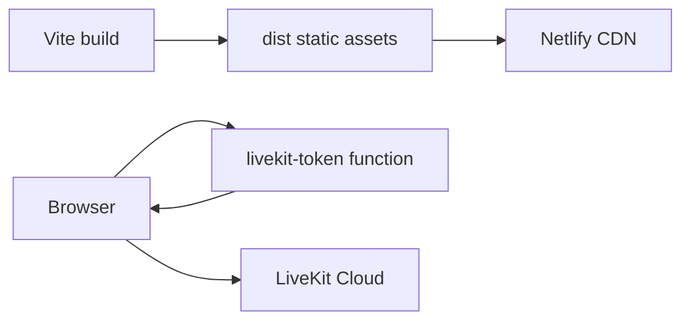

# Netlify architecture

Netlify is the current deployment boundary for the web application. It is not the game authority.

## Responsibilities

- `netlify.toml` runs `npm run build`, publishes `dist/`, and registers `netlify/functions`.
- `functions/livekit-token.js` validates room/participant metadata and signs short-lived LiveKit JWTs using `jose`.
- `LIVEKIT_URL`, `LIVEKIT_API_KEY`, and `LIVEKIT_API_SECRET` remain server-side.
- The function returns a LiveKit URL and participant token; it does not join the room itself.

There is no room storage, rules execution, reconnect state, or game database in Netlify today. Current game authority lives in the host browser.

The production roadmap may keep Netlify for the frontend and media-token function while adding a separate game-service origin. If that happens, cross-origin configuration, environment ownership, deployment, and monitoring must be documented at the top-level architecture boundary.
