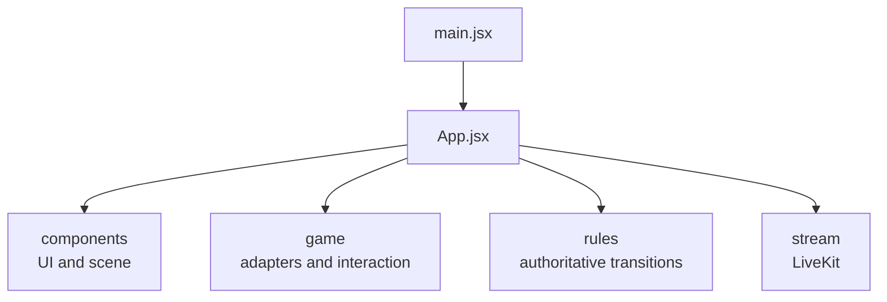
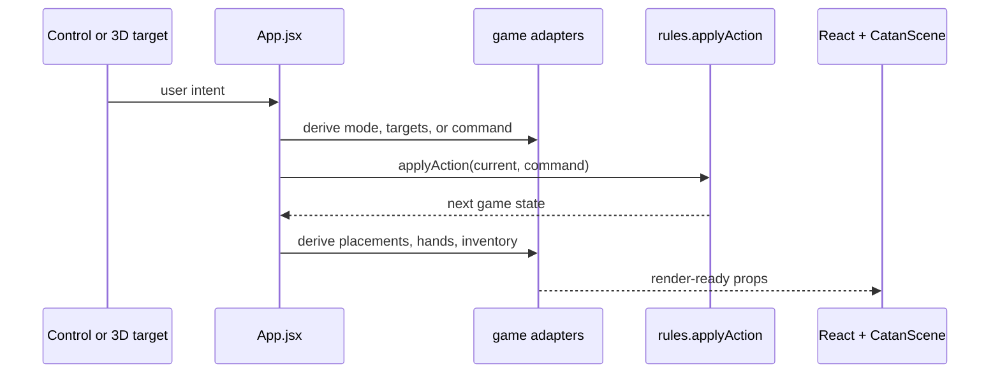

# Client architecture

The `src` directory is the browser application. It combines React UI, the Three.js table, the rules engine, game-specific adapters, and LiveKit transport.

## Composition

- `main.jsx` mounts React.
- `App.jsx` is the composition root and current state owner.
- `components/` presents state and reports user intent through callbacks.
- `game/` converts between visual/UI concepts and rules-engine concepts.
- `rules/` owns game legality and state transitions.
- `stream/` connects the browser to LiveKit.
- `three/` builds reusable 3D objects used by `CatanScene`.
- `styles/` contains application, game-control, and LiveKit presentation.

## State ownership

`App.jsx` currently owns:

- The generated visual board and topology.
- The full authoritative game state in local/host mode.
- Lobby and participant state.
- The local viewer/seat and its sanitized player view.
- Temporary interaction state such as selected targets, feedback, highlights, and dice animation.
- The boundary between local dispatch and multiplayer action requests.

Components do not directly mutate the game. They receive props and call callbacks; `App.jsx` turns those requests into rules actions.

## Action and render flow

In current online play, a non-host sends the command through LiveKit and the host performs the rules step. In development local test mode, the browser dispatches directly and can simulate other players. The production roadmap replaces both online branches with a server transport adapter while preserving the component and rules boundaries.

## Privacy boundary

The full game object is required for rules execution. Player-facing private data should come from `getPlayerView(game, viewerId)`. The view is safe for presentation; it is not a source for applying rules.

Current multiplayer still transports full host snapshots, so network privacy is not production-safe. Server-authoritative V1 will create a separate sanitized view for each connection.

## Local guides

- [Components](components/ARCHITECTURE.md)
- [Game adapters](game/ARCHITECTURE.md)
- [Rules engine](rules/ARCHITECTURE.md)
- [LiveKit integration](stream/ARCHITECTURE.md)
- [Three.js factories](three/ARCHITECTURE.md)

Keep this guide at the application-boundary level. Detailed rules APIs belong in `rules/README.md`; individual component behavior belongs in code and tests.
