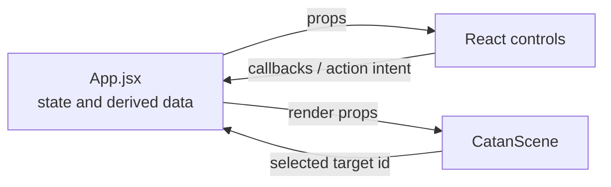

# Component architecture

React components present the game and report user intent. They do not decide whether a game action is legal and do not own authoritative game state.

## Component groups

| Area | Role |
|------|------|
| `CatanScene.jsx` | Owns the Three.js scene lifecycle and turns render props into the 3D table |
| `StartGameOverlay.jsx` | Player count, local test-mode entry, seats, and game start |
| `GameControlPanel.jsx` | Composes the active-game controls and status surfaces |
| `GameOverOverlay.jsx` | Winner, final state, restart, and new-game actions |
| `game/*Controls.jsx` | Focused building, trading, development-card, robber, resource, and turn controls |
| `PlayerSetup.jsx` / `BoardPreview.jsx` | Smaller setup and preview surfaces |

## Interface pattern

- Data flows down as props.
- User intent flows up through callbacks.
- `App.jsx` converts intent into an engine command.
- Controls use `playerView` for seat-private presentation.
- A component may own temporary form state, but not resources, pieces, turns, scores, or board ownership.

`GameControlPanel` is a layout/composition component. It delegates specialized workflows to smaller controls rather than implementing their rules.

## Three.js boundary

`CatanScene` creates one persistent renderer, scene, camera, controls, and animation loop. It maintains separate groups for stable terrain and for changing pieces, highlights, player areas, dice, and robber state.

React supplies plain data such as board hexes, placements, legal target IDs, hands, inventories, and dice. Scene pointer selection returns stable vertex/edge/hex IDs; the `game` adapters translate those IDs into actions.

Low-level mesh construction stays in [`src/three`](../three/ARCHITECTURE.md). `CatanScene` owns placement, updates, interaction, animation, and disposal.

## UI direction

The current MVP mixes the 3D table with DOM controls and overlays. A separate planned UX roadmap will move player-facing information toward the 3D table while retaining accessible semantics and a development-only control surface. That layout change should not move rules or authoritative state into components.

Keep this document focused on component responsibilities. Exact props, form fields, and render conditions are easier to understand from the component and its tests.
