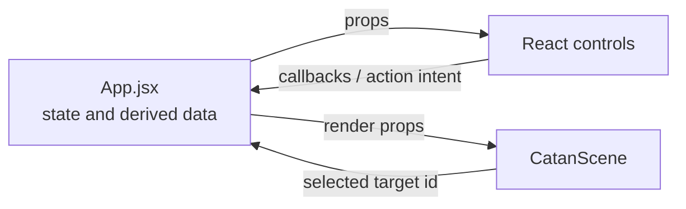

# Component architecture

React components present the game and report user intent. They do not decide whether a game action is legal and do not own authoritative game state.

## Component groups

| Area | Role |
|------|------|
| `CatanScene.jsx` | Owns the Three.js scene lifecycle and turns render props into the 3D table |
| `StartGameOverlay.jsx` | Lobby card: host lobby (invite link, player count, colors, start), guest color picker, waiting, lobby-full screen, solo and local-test setup |
| `game/SettingsMenu.jsx` | Small gear in the bottom-right corner: bots/solo game, reset camera, restart, rules link, dev-only tools |
| `GameControlPanel.jsx` | Board-first HUD: one-line prompt, toasts, resource/hand-count chips, and only the relevant actions ending in one highlighted primary action |
| `GameOverOverlay.jsx` | Winner, final state, restart, and new-game actions |
| `game/*Controls.jsx` | Focused building, trading (swap-icon flow), development-card, robber, resource, and turn controls; larger flows open as sheets over the board |
| `game/GameToasts.jsx` | Short, player-colored action toasts (non-interactive, max 3) |
| `PlayerSetup.jsx` / `BoardPreview.jsx` | Smaller setup and preview surfaces |

## Interface pattern

```mermaid
flowchart LR
    APP["App.jsx<br/>state and derived data"] -->|"props"| PANEL["React controls"]
    APP -->|"render props"| SCENE["CatanScene"]
    PANEL -->|"callbacks / action intent"| APP
    SCENE -->|"selected target id"| APP
```

- Data flows down as props.
- User intent flows up through callbacks.
- `App.jsx` converts intent into an engine command.
- Controls use `playerView` for seat-private presentation.
- A component may own temporary form state, but not resources, pieces, turns, scores, or board ownership.

`GameControlPanel` is a layout/composition component (the board HUD). It delegates specialized workflows to smaller controls rather than implementing their rules.

## Three.js boundary

`CatanScene` creates one persistent renderer, scene, camera, controls, and animation loop. It maintains separate groups for stable terrain and for changing pieces, highlights, player areas, dice, and robber state.

React supplies plain data such as board hexes, placements, legal target IDs, hands, inventories, and dice. Scene pointer selection returns stable vertex/edge/hex IDs; the `game` adapters translate those IDs into actions.

Low-level mesh construction stays in [`src/three`](../three/ARCHITECTURE.md). `CatanScene` owns placement, updates, interaction, animation, and disposal.

## UI direction

The board fills the viewport. DOM controls are compact overlays on it: a one-line prompt and toasts at the top, resource and hand-count chips plus the relevant action buttons along the bottom edge, and the settings gear in the bottom-right corner (safe-area aware). Only actions relevant to the current phase are shown (builds are grouped under one Build menu); trade and development-card choices open as sheets and close back to the board. That layout change should not move rules or authoritative state into components.

Keep this document focused on component responsibilities. Exact props, form fields, and render conditions are easier to understand from the component and its tests.
