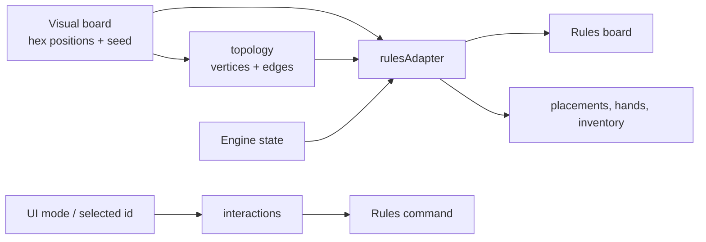

# Game adapter architecture

The `game` directory bridges visual/UI concepts and the UI-independent rules engine. It answers questions such as "where is this hex on the table?", "which edge did the player select?", and "how should engine state be displayed?"

It does **not** decide whether an action is legal; final validation belongs to `src/rules`.

## Data flow

## Module responsibilities

| Module | Role |
|--------|------|
| `board.js` | Creates the seeded 19-hex island and number-token layout |
| `terrain.js` | Terrain definitions, resource mapping, and terrain deck |
| `topology.js` | Derives shared intersections and edges from hex geometry |
| `rulesAdapter.js` | Converts the visual board into a rules board and engine state into render data |
| `interactions.js` | Selects interaction modes, legal target IDs, commands, labels, and build availability |
| `multiplayerRoom.js` | Current client-side lobby model, seats, roles, presence, and LiveKit message names |
| `pieces.js` | Player colors and visible piece inventory helpers |
| `setupFlow.js` | Setup-order presentation helpers |
| `resources.js` | Legacy/presentation starting-resource helpers |
| `usePlayerView.js` | Memoized React access to the rules privacy view |

## Important boundaries

- Visual coordinates stay here or in rendering code; the rules engine uses stable IDs and adjacency.
- The rules engine is the final authority even when this layer calculates legal targets for highlighting.
- Adapters may derive display data but must not invent resources, placements, or scores.
- `multiplayerRoom.js` models the current host-authoritative MVP. The production server will own room and seat truth; the client will retain only view/transport helpers.
- Seeded generation is used so boards and ports can be reproduced in tests and bug reports.

## Typical interaction

1. `getInteractionMode` chooses the active board-selection mode from phase and user choice.
2. `getLegalTargets` derives IDs to highlight.
3. `CatanScene` returns the clicked ID.
4. `actionForTarget` creates a rules command.
5. `applyAction` performs authoritative validation.
6. `rulesAdapter` converts the returned state into render props.

Keep algorithms for Catan legality in `src/rules`; keep coordinate, selection, and presentation translation here.
