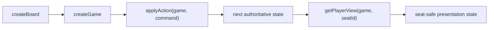

# Rules engine architecture

The rules directory is the UI-independent game state machine. It should run unchanged in the current browser, tests, and the planned authoritative server.

## Public boundary

Most consumers import from `index.js` rather than individual modules.

## Module responsibilities

| Module | Role |
|--------|------|
| `constants.js` | Resources, costs, piece limits, development deck, and win/player limits |
| `board.js` | Board validation, adjacency, placement connectivity, ports, and cloning |
| `game.js` | Game creation, phases, commands, resource movement, robber, trades, and development cards |
| `scoring.js` | Longest road, largest army, public/private score helpers, and victory |
| `playerView.js` | Removes information a particular seat is not allowed to know |
| `index.js` | Supported import surface |

## State transition model

`applyAction` receives the current full state and a command. It checks action type, phase, turn, ownership, cost, inventory, and board legality, then returns a new state. Invalid commands throw and do not change the supplied state.

Random outcomes are injected where needed so the production authority can own randomness and tests can be deterministic.

The engine log records public game events. It is part of state, but future network snapshots should keep history bounded rather than growing every client message indefinitely.

## Privacy model

The full state contains every hand, development card, deck order, and private score. It is never safe as a player-facing network payload.

`getPlayerView` preserves public board/game information and the viewing seat's private information while reducing opponents to public counts and scores. Rules always run against full state; player views are read-only presentation/transport projections.

## Dependency rule

This directory must not import React, Three.js, LiveKit, browser storage, DOM APIs, or UI adapters. It may work with stable board and player IDs supplied by callers.

See [README.md](README.md) for the detailed board shape, supported commands, and player-view field contract.
