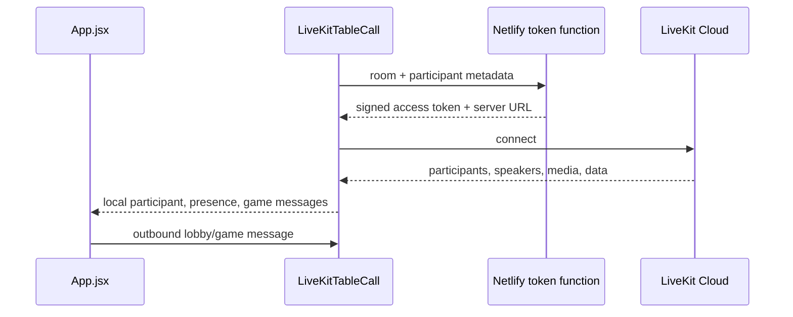

# LiveKit integration architecture

The `stream` directory connects a browser to the current LiveKit table. `LiveKitTableCall.jsx` owns the SDK lifecycle and reports network/media state back to `App.jsx`.

## Current flow

## Responsibilities

- Create or recover the current room identity/invite link.
- Request a short-lived token without exposing the LiveKit secret.
- Connect/disconnect the LiveKit `Room` and clean up event handlers/tracks.
- Publish and subscribe to camera and microphone tracks.
- Attach subscribed audio and render player video bubbles.
- Map LiveKit participants to game seats using metadata.
- Publish and decode the current `catan-game` data topic.
- Report connection, participant, and active-speaker state through callbacks.

Display name, participant ID, selected seat, and hosted-room hints use `localStorage` for refresh convenience. They are not secure authentication credentials.

## Current coupling and planned boundary

Today LiveKit carries both media and host-authoritative game traffic. That makes joining LiveKit a gameplay requirement and means the host browser remains the rules process.

For production V1, gameplay moves to a dedicated server transport. This directory then becomes an optional media adapter: a player can join and finish a game without connecting to LiveKit. Game commands, seat credentials, persistence, and private views must not depend on this component.

Keep LiveKit SDK details here rather than spreading room or media lifecycle code across game controls.
