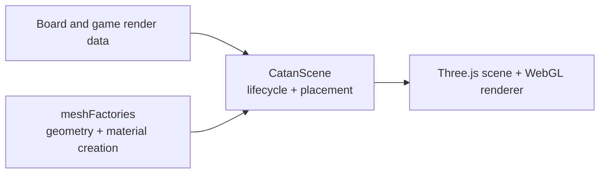

# Three.js rendering architecture

The `three` directory contains reusable object factories. The React component [`CatanScene`](../components/ARCHITECTURE.md) owns the live renderer and calls these factories to populate the table.

## Ownership split

`meshFactories.js` creates:

- Hex tiles and number tokens.
- Roads, settlements, cities, and the robber.
- Legal-target and production highlights.
- Resource cards, dice, and ports.

Factories return Three.js objects without knowing React state, game phases, board ownership, or screen layout. Color and small geometry inputs are supplied by the caller.

`CatanScene` is responsible for:

- The renderer, camera, lights, table surface, and orbit controls.
- Positioning objects using board/topology coordinates.
- Stable scene groups and incremental updates.
- Pointer hit testing and returning stable target IDs.
- Animation and render scheduling.
- Disposing geometries/materials when a layer is replaced or the component unmounts.

Shared image textures are cached by `CatanScene`; generated materials and geometries must still be disposed correctly. Keep visual construction in the factories and stateful scene lifecycle in the component.
