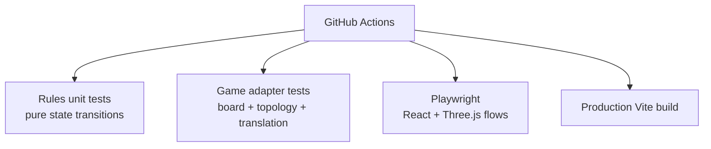

# Test architecture

Tests are split by architectural boundary so failures point to the layer that owns the behavior.

## Test layers

| Location | Tool | Boundary covered |
|----------|------|------------------|
| `tests/rules/` | Vitest | Rules state machine, legality, scoring, and private player views |
| `tests/game/` | Vitest | Visual board, topology, adapters, interactions, lobby helpers, and rules integration |
| `tests/board-rules.test.js` | Node test | Standalone randomized-board invariants |
| `tests/game-flow.spec.js` | Playwright | Complete browser gameplay using development local test mode |
| `tests/release-quality.spec.js` | Playwright | Responsive and accessible development lifecycle checks |
| `tests/three-render.spec.js` | Playwright | Non-blank Three.js rendering on desktop/mobile |

Unit tests should cover rules and transformations without React or WebGL. Playwright is reserved for behavior that depends on the assembled browser application.

The development-only `window.__CATAN_TEST_API` drives deterministic actions through the same application handlers while avoiding brittle canvas-coordinate clicks. It is a testing surface, not a production gameplay API.

CI runs unit tests, the production build, and Playwright. Future server-authoritative work adds protocol, persistence, and simultaneous multi-client suites without replacing these client/rules layers.

See [README.md](README.md) for commands, file-by-file coverage, debugging, and test-writing conventions.
